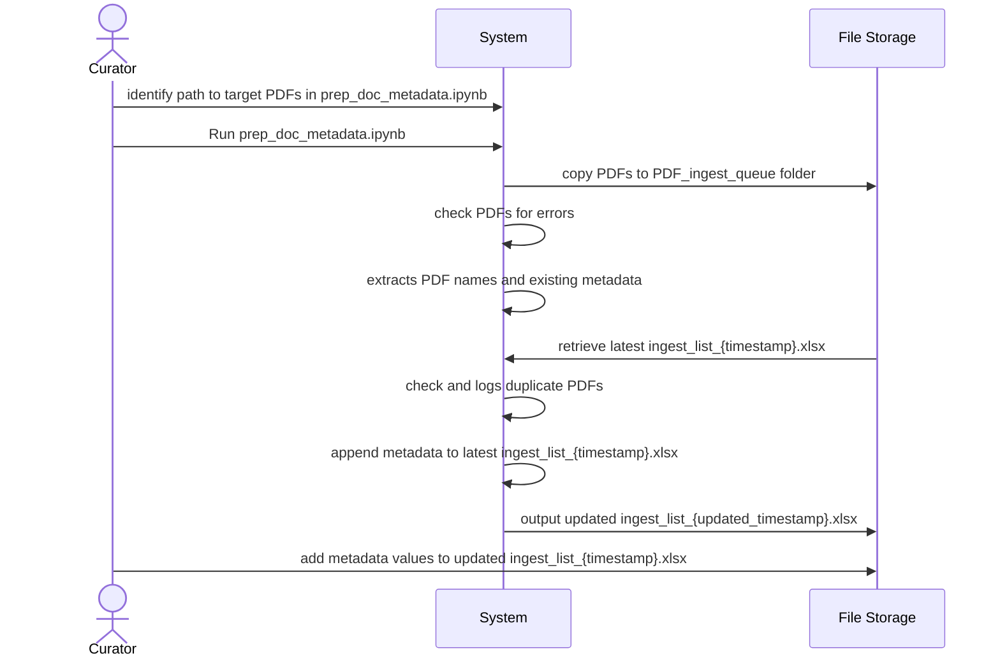
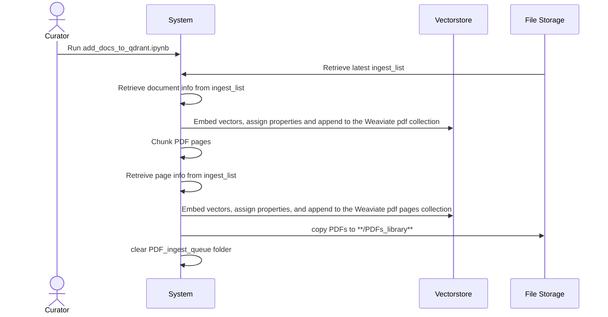

## ASK System Administration (Weaviate)
#### Adding PDFs to Library
##### 1. Prepare the document metadata

```mermaid
sequenceDiagram
    actor Curator
    participant System
    participant File Storage
    
    Curator->>System: identify path to target PDFs in prep_doc_metadata.ipynb
    Curator->>System: Run prep_doc_metadata.ipynb
    System->>File Storage: copy PDFs to PDF_ingest_queue folder
    System->>System: check PDFs for errors
    System->>System: extracts PDF names and existing metadata
    File Storage->>System: retrieve latest ingest_list_{timestamp}.xlsx
    System->>System: check and logs duplicate PDFs
    System->>System: append metadata to latest ingest_list_{timestamp}.xlsx
    System->>File Storage: output updated ingest_list_{updated_timestamp}.xlsx
    Curator->>File Storage: add metadata values to updated ingest_list_{timestamp}.xlsx
```

##### 2. Add the PDF docs and metadata to the vectorstore

```mermaid
sequenceDiagram
    actor Curator
    participant System
    participant Vectorstore

    Curator->>System: Run add_docs_to_qdrant.ipynb 
    File Storage->>System: Retrieve latest ingest_list
    System->>System: Retrieve document info from ingest_list
    System->>Vectorstore: Embed vectors, assign properties and append to the Weaviate pdf collection
    System->>System: Chunk PDF pages
    System->>System: Retreive page info from ingest_list
    System->>Vectorstore: Embed vectors, assign properties, and append to the Weaviate pdf pages collection
    System->>File Storage: copy PDFs to **/PDFs_library**
    System->>System: clear PDF_ingest_queue folder
```

